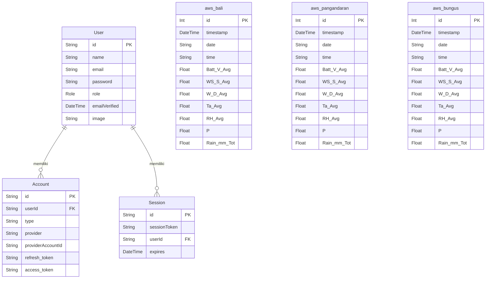

```mermaid
erDiagram
    User ||--o{ Account : "memiliki"
    User ||--o{ Session : "memiliki"

    User {
        String id PK
        String name
        String email
        String password
        Role role
        DateTime emailVerified
        String image
    }

    Account {
        String id PK
        String userId FK
        String type
        String provider
        String providerAccountId
        String refresh_token
        String access_token
    }

    Session {
        String id PK
        String sessionToken
        String userId FK
        DateTime expires
    }

    aws_bali {
        Int id PK
        DateTime timestamp
        String date
        String time
        Float Batt_V_Avg
        Float WS_S_Avg
        Float W_D_Avg
        Float Ta_Avg
        Float RH_Avg
        Float P
        Float Rain_mm_Tot
    }
    
    aws_pangandaran {
        Int id PK
        DateTime timestamp
        String date
        String time
        Float Batt_V_Avg
        Float WS_S_Avg
        Float W_D_Avg
        Float Ta_Avg
        Float RH_Avg
        Float P
        Float Rain_mm_Tot
    }
    
    aws_bungus {
        Int id PK
        DateTime timestamp
        String date
        String time
        Float Batt_V_Avg
        Float WS_S_Avg
        Float W_D_Avg
        Float Ta_Avg
        Float RH_Avg
        Float P
        Float Rain_mm_Tot
    }

```
