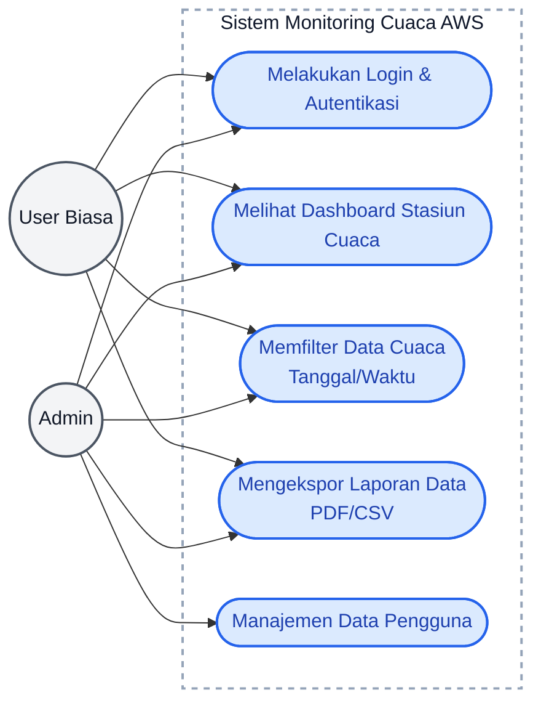

```mermaid
flowchart LR
    %% Pengguna Sistem (Actors)
    Admin((Admin))
    User((User Biasa))

    %% Batasan Sistem (System Boundary)
    subgraph Sistem_Monitoring_Cuaca_AWS [Sistem Monitoring Cuaca AWS]
        direction TB
        UC1([Melakukan Login & Autentikasi])
        UC2([Melihat Dashboard Stasiun Cuaca])
        UC3([Memfilter Data Cuaca <br/>Tanggal/Waktu])
        UC4([Mengekspor Laporan Data <br/>PDF/CSV])
        UC5([Manajemen Data Pengguna])
    end

    %% Relasi (Relationships)
    User --> UC1
    User --> UC2
    User --> UC3
    User --> UC4
    
    Admin --> UC1
    Admin --> UC2
    Admin --> UC3
    Admin --> UC4
    Admin --> UC5

    %% Styling 
    classDef actor fill:#f3f4f6,stroke:#4b5563,stroke-width:2px,color:#111827;
    classDef usecase fill:#dbeafe,stroke:#2563eb,stroke-width:2px,color:#1e40af,shape:capsule;
    classDef system fill:#ffffff,stroke:#94a3b8,stroke-width:2px,stroke-dasharray: 5 5,color:#0f172a;

    class Admin,User actor;
    class UC1,UC2,UC3,UC4,UC5 usecase;
    class Sistem_Monitoring_Cuaca_AWS system;
```
