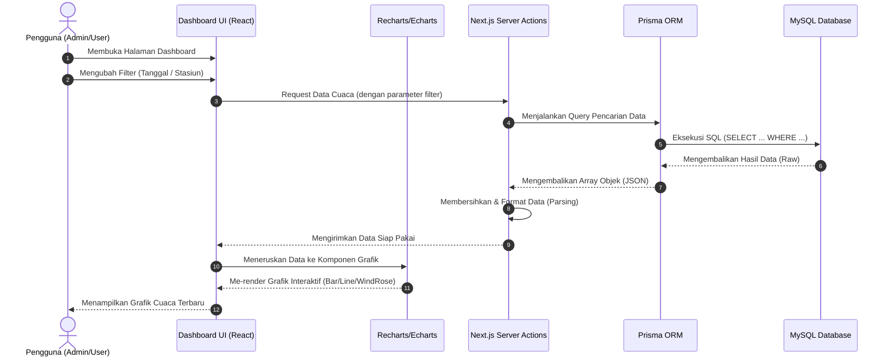

```mermaid
sequenceDiagram
    autonumber
    
    actor User as Pengguna (Admin/User)
    participant UI as Dashboard UI (React)
    participant Chart as Recharts/Echarts
    participant Server as Next.js Server Actions
    participant Prisma as Prisma ORM
    participant DB as MySQL Database

    User->>UI: Membuka Halaman Dashboard
    User->>UI: Mengubah Filter (Tanggal / Stasiun)
    
    UI->>Server: Request Data Cuaca (dengan parameter filter)
    
    Server->>Prisma: Menjalankan Query Pencarian Data
    Prisma->>DB: Eksekusi SQL (SELECT ... WHERE ...)
    
    DB-->>Prisma: Mengembalikan Hasil Data (Raw)
    Prisma-->>Server: Mengembalikan Array Objek (JSON)
    
    Server->>Server: Membersihkan & Format Data (Parsing)
    Server-->>UI: Mengirimkan Data Siap Pakai
    
    UI->>Chart: Meneruskan Data ke Komponen Grafik
    Chart-->>UI: Me-render Grafik Interaktif (Bar/Line/WindRose)
    
    UI-->>User: Menampilkan Grafik Cuaca Terbaru
```
